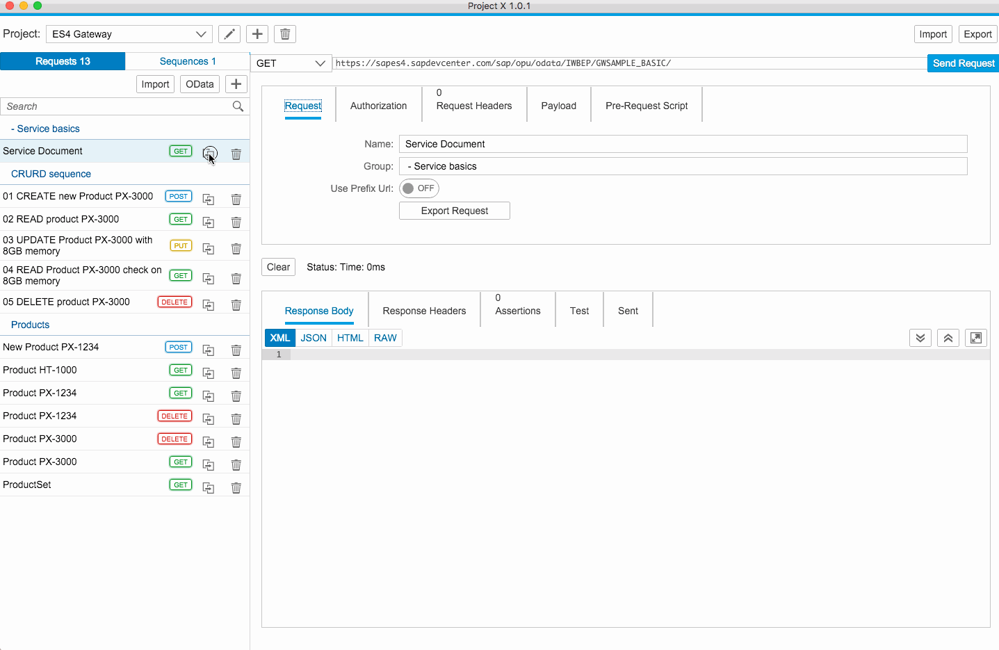

[](https://travis-ci.org/pensoffsky/projectX)

# Features 

[](https://gitter.im/pensoffsky/projectX?utm_source=badge&utm_medium=badge&utm_campaign=pr-badge&utm_content=badge)
- create assertions for requests
- fetch and set CSRF token on modifying requests
- automatically create GET request for entitysets from OData metadata
- import and export projects and single requests in JSON format for team collaboration
- runs in browser or as standalone app (thanks to [Electron](http://electron.atom.io))



## Screencast tutorials
* [Switch projects](documentation/projectSwitch.md)
* [Grouping of requests](documentation/requestGrouping.md)
* [Sequences of requests](documentation/sequenceOfRequests.md)
* [Customzine requests with JavaScript](documentation/prerequestScript.md)
* [Create test scripts](documentation/testScript.md)
* [Switch to fullscreen mode for response body](documentation/fullscreenResponsebody.md)

# Download
Find the [latest stable version](https://github.com/pensoffsky/projectX/releases/latest)
of the 'electron' ZIP file in [release](https://github.com/pensoffsky/projectX/releases) section.

# Contribution
Clone the git repository.

Install [NPM](https://www.npmjs.com/), afterwards you can install
[GRUNT](http://gruntjs.com/) and [Bower](http://bower.io/) by following command
```
npm install -g bower grunt-cli
```

Install the project dependencies.
```
npm install
bower install
grunt copyresources
```

Host the application locally.
```
grunt
```

## Update version number of projectX
Change version number in package.json file and use following grunt task to
update version information in index*.html files.
```
grunt htmlbuild
```

# Build on your own
## Build an executable app
Builds an application which is based on [Electron](http://electron.atom.io) shell
for Mac OS X and Windows platform.
```
grunt build
```

## Build BSP-application
Following command builds an BSP compatible application, ready for uploading into
SAP Gateway. The task runs endless in your Terminal and provides the ZIP file (release_projectX.zip), which can be uploaded with report /UI5/UI5_REPOSITORY_LOAD_HTTP.
```
grunt buildGw
```
You can end the task by pressing CTRL + C.
